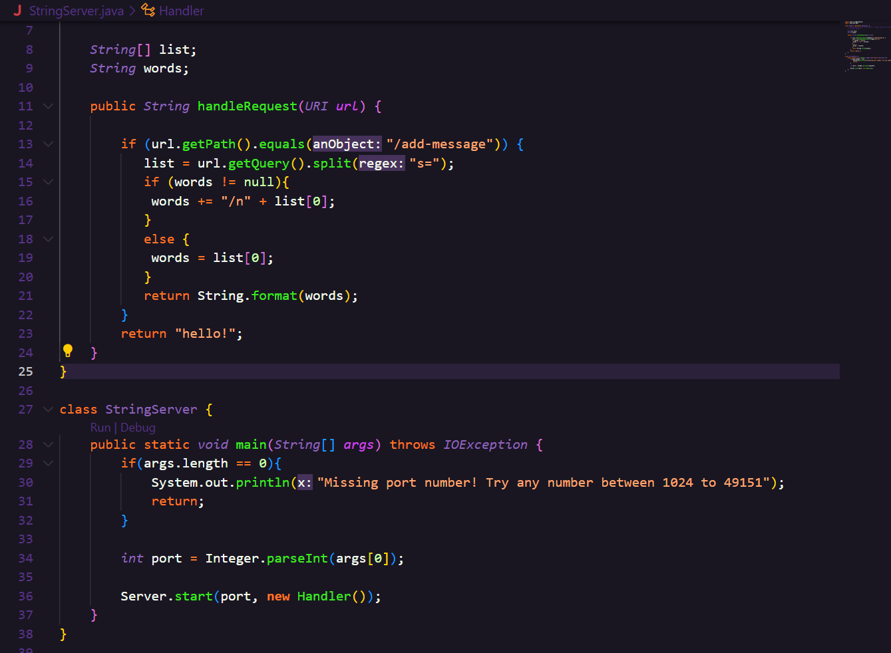
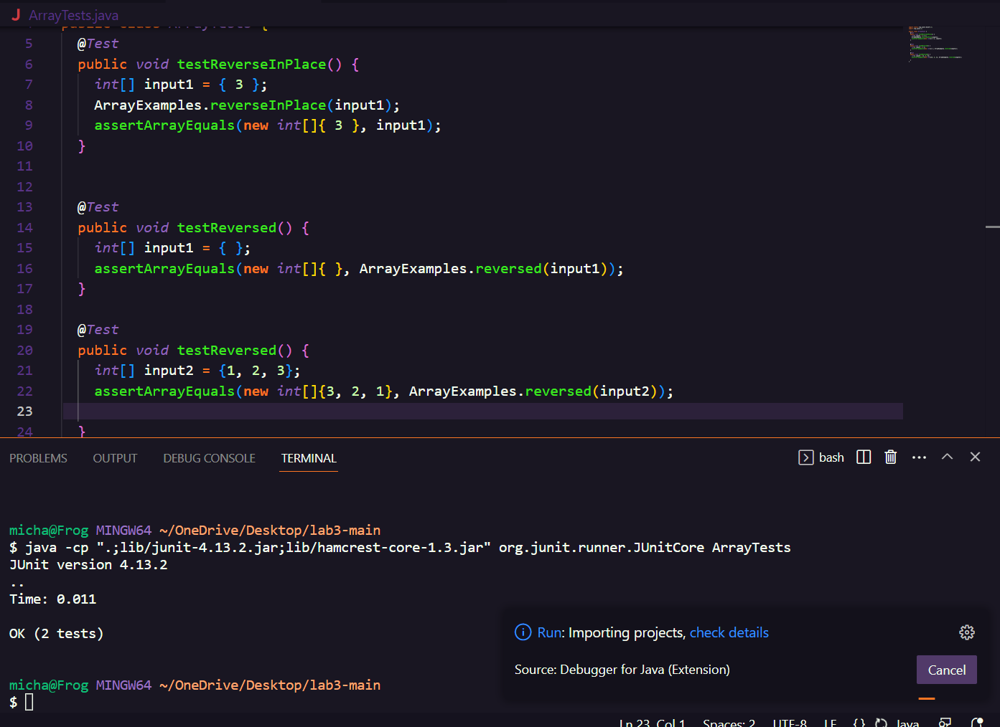

**Lab Report 2**

**Part 1**

**Part 2**
A failure inducing input regarding ArrayExamples.java is the reversed() method with a parameter of a simple array such as {1, 2, 3}. The outcome would always be {1, 2, 3} because reversed() returns "arr" rather than newArrAy.

A non-failure inducing input regarding ArrayExample's reversed() method is it with a paramter of an array {1, 2, 1}. Because this array is the same forward and backwards, returning the original array would yield the favored results

Unfortunately, due to time and VSCode, I can't give a screenshot :( Here is me trying to run it and failing.

To fix the bug, all that needs to occur is make reversed() return newArray rather than arr.

**Part 3**
Beforehand, I did not realize there was a java import in which allowed us to create website servers just like that! Not only that, but understanding more about search links and how a question mark signifies a natural break in the URL is really intriguing. It allows me to manipulate code in the way that it treats characters separated by the question mark differently, as I can see how it differentiates new words or even new requests in updating the localhost URL.

