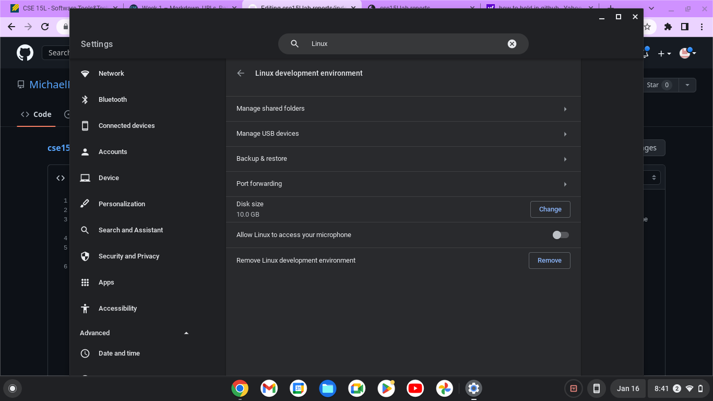

**Lab Report 1**

For this lab report, I will be describing a step by step process in the method I used to download VSCode, using it to remotely connect, then attempting some commands!

For the first part, it was atypical of a standard download. This is because my chromebook runs ChromeOS rather than Windows, making installation of VSCode slightly tricky. Firstly, I had to download Linux on my computer, which essentially would act like a program that VSCode could use to run. To do this, yousimply had to look up "Linux" in your chromebook's settings. Although this is the screen I have since I already downloaded Linux, normally you would have an option to download Linux rather tham the option to remove Linux as shown here in this screenshot.

After waiting a few minutes for Linux to download, I was now ready to download VSCode! 

