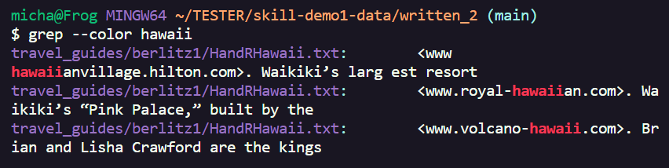
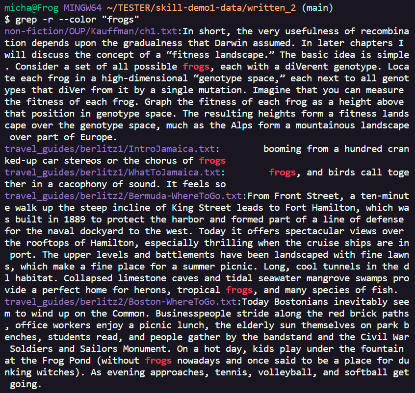
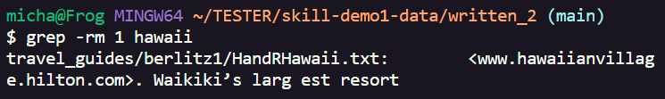
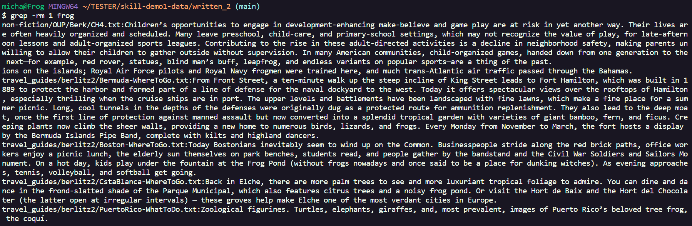
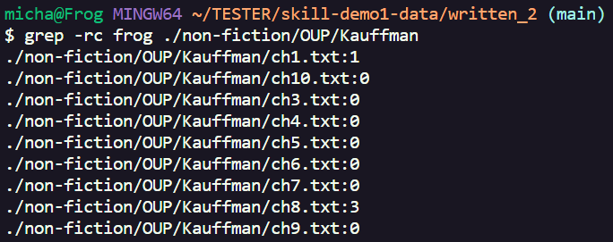
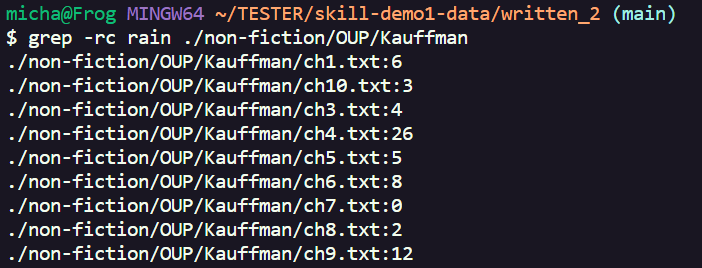

**Lab Report 3**

For this lab, I will have chosen to study and research the "grep" command, as it seems the most appealing to me as it seems very useful in finding specific strings of texts in a large amount of files. 

To start, I went ahead and asked ChatGPT for a rundown on some grep command-line options!

I decided to pick "", "", "", and "" for this lab report! However, I would like to briefly state that each my command-line options for grep will start with "-rl", as it helps a lot with recursively searching through "./written_2" without explicitly needing to state a file, allowing me to search through the entirety of "./written_2" and its subdirectories rather than just searching through a singular file! 

**1. "--color"**
"grep -r --color [pattern]" is a command that will search through "./written_2" for files that contain the pattern, then print each file and its text one by one. However, using the "--color" option, the instances of the pattern will now be highlighted in a different color font, allowing for clear and easy access of where the pattern actually is in the files! Here are some examples:

Essentially, it makes searching for the exact instances of a pattern much easier! For example, if you wanted to read more about frogs, it would give a clear place as to which sentences in the text file have "frogs"!

**2. "-m"**
"grep -rm [n] [pattern]" is a command that will search through "./written_2" 'n' amount of times for the pattern, stopping the search once it reaches 'n' or there are no more matches, with 'n' being a positive integer. This can be helpful in giving the first few instances of the specified pattern Here are some examples:

Here, I set n to 1, allowing grep to simply show me the first instance of both hawaii and frogs, showing which file they appear in first.

**3. "-c"**
"grep -rc [pattern]" is a command that will search through "./written_2" for the pattern, and display the amount of times that aforementioned pattern is seen in that file. Here are two examples:

Here, we can see the amount of times that the words "frog" and "rain" appear in the Kauffman folder's contents. This is useful as it gives an understanding on which file discusses these topics the most, allowing for quick access over which files to prioritize when looking for the amount of that pattern.
**4. ""**

