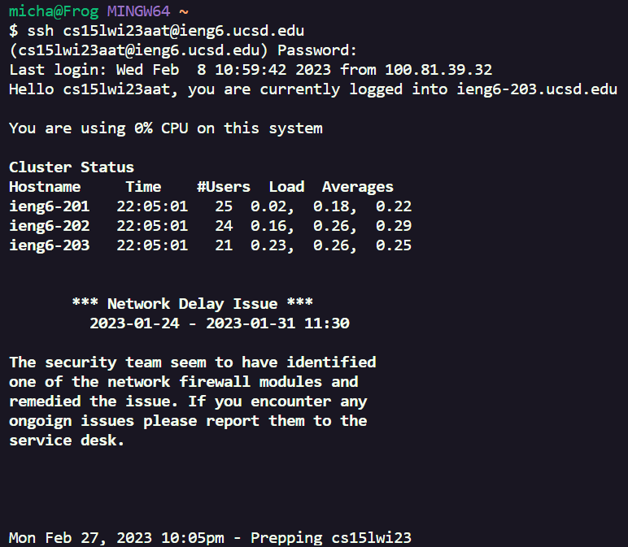
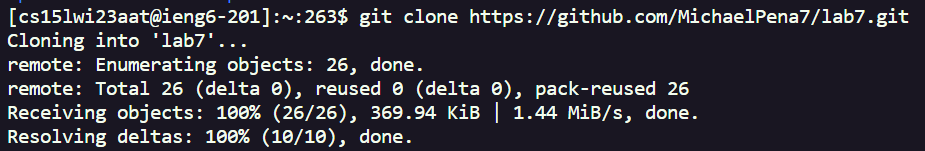
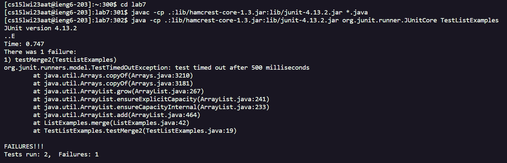
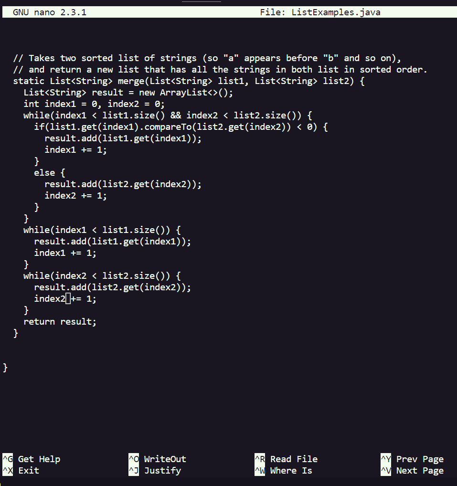
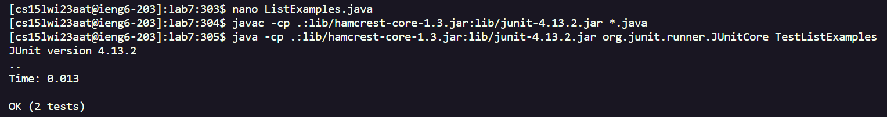
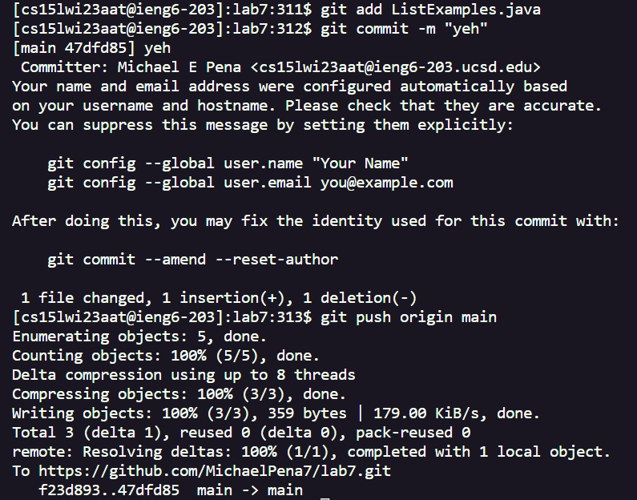

**Lab Report 4**

**Step 4**

 
 **Buttons Pressed**
 
 \<up>\<up>\<up>\<up>\<up>\<up>\<up>\<up>\<up>\<up>\<up>\<enter>
 
 *typed password* \<enter>
 
**Explanation**
 
My ieng6 username was 11 commands away due to my previous attempt, so I simply needed to press up to find and execute it. From there, I was able to type my password to finish Step 4 and log in
 
 
**Step 5**

 
**Buttons Pressed**
 
*typed "git clone"*
 
*clicked the copy button from my fork of lab7 from GitHub*
 
\<Ctrl+P>\<enter>
 
**Explanation**
 
For Step 5, I just felt like typing git clone was easier than looking for the command using the up method. Then, I just quickly grabbed the link to my GitHub lab7 repository to clone it. I pasted it using Ctrl+P into my terminal, and from  there I was able to run and clone my fork of lab7
 
 **Step 6**
 
 
 
 **Buttons Pressed**
 
 *typed "cd lab7"*\<enter>
 
 \<up>\<up>\<up>\<up>\<up>\<up>\<up>\<up>\<up>\<up>\<enter>
 
 \<up>\<up>\<up>\<up>\<up>\<up>\<up>\<up>\<up>\<up>\<enter>
 
**Explanation**
First, I typed "cd lab7", as it is a relatively short command and it brings me to the correct directory to access testListExamples.java and compile and run it. Then, with the sheer size and complexity of the compile and run commands in mind, I opted to use my command history and find my previous attempt's compile and run commands by pressing up 10 times for each. From there, I was able to demonstrate the failed test.

**Step 7**

**Buttons Pressed**

 *typed "nano Lis"* \<tab>
 *typed "java"* \<enter>
 
 \<down>\<down>\<down>\<down>\<down>\<down>\<down>\<down>\<down>\<down>\<down>\<down>\<down>\<down>\<down>\<down>\<down>\<down>\<down>\<down>\<down>\<down>
 \<right>\<right>\<right>\<right>\<right>\<right>\<right>\<right>\<right>\<right>\<right>\<right>
 \<backspace>
 *typed 2*
 
 \<Ctrl+O>\<enter>\<Ctrl+X>

**Explanation**
To change the file and fix the test error, I first needed to open ListExamples.java under nano. To do this, I started with "nano Lis" and then pressed tab so that the autocomplete shortcut would finish the rest for me. However, since there is a file called ListExamples.class, I had to type the remaining "java" to finish the command, as it left me with "nano ListExamples.". Once I ran the command, nano editing opened up. I quickly scrolled to the error by pressing down and right 22 and 12 times respectively. I then deleted the "1" causing the error, an replaced it with "2". Then, to save the changes, I typed Ctrl+O, and then confirmed the save with enter. Finally, all that was left for this step was to exit nano using Ctrl+X.

**Step 8**

**Buttons Pressed**

\<up>\<up>\<up>\<enter>

\<up>\<up>\<up>\<enter>

**Explanation**

Since I just recently complied and ran the test file, I only had to press up three times for both to initiate the compile and run process to test out TestListExamples.java and show that my edits were successful and made all tests work.

**Step 9**

**Buttons Pressed**

*typed "git add Lis"*\<tab>
*typed "java'*\<enter>

*typed 'git commit -m "yeh"\<enter>

\<up>\<up>\<up>\<up>\<up>\<up>\<up>\<up>\<up>\<up>\<enter>
 
**Explanation**

I had already memorized the first two commands to commit a change from nano to GitHUb, being "git add \[file]", and 'git commit -m \[message], so I decided to type them. Not without shortcuts however, as I used the same shortcut I did in Step 7 to allow most of the file name to autocomplete for me, and of course since the ".class" file still exists, I still had to type "java" at the end. After running the first one, I then ran the commit command, and deciding to pick a simple and silly message "yeh". Finally, I admittedly forgot the last push command, so I pressed up 11 times to access my previous version and find out it was "git push main origin". I then simply pressed enter and I was met with a sucess line, meaning I officially completed all the steps!
 
