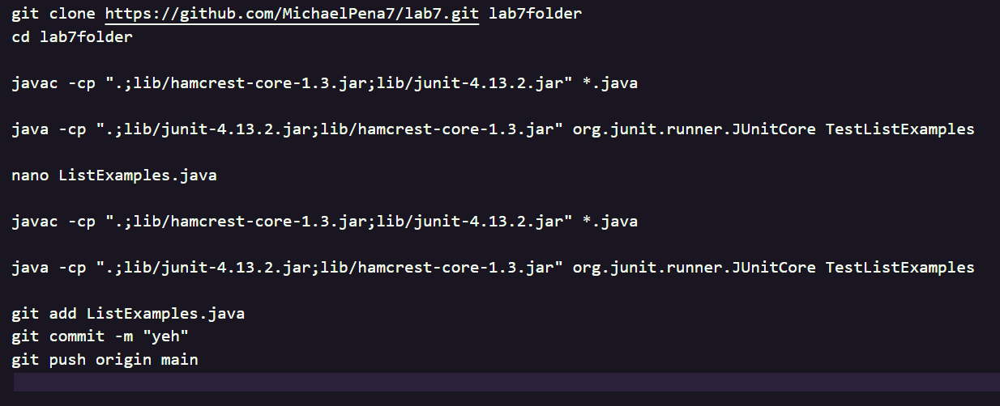
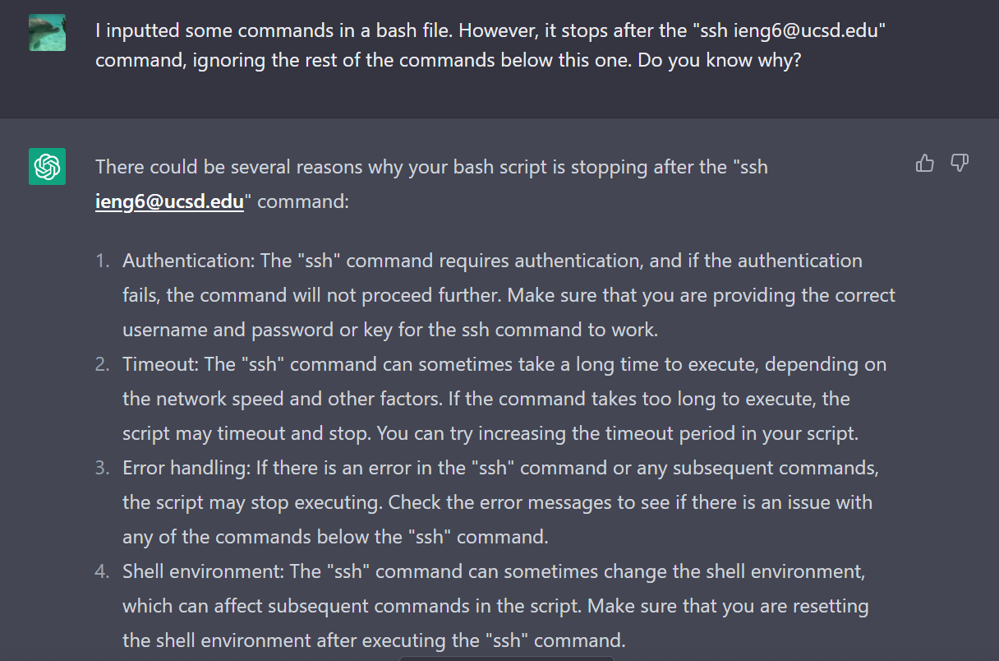
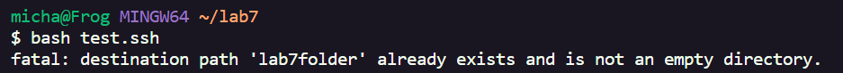
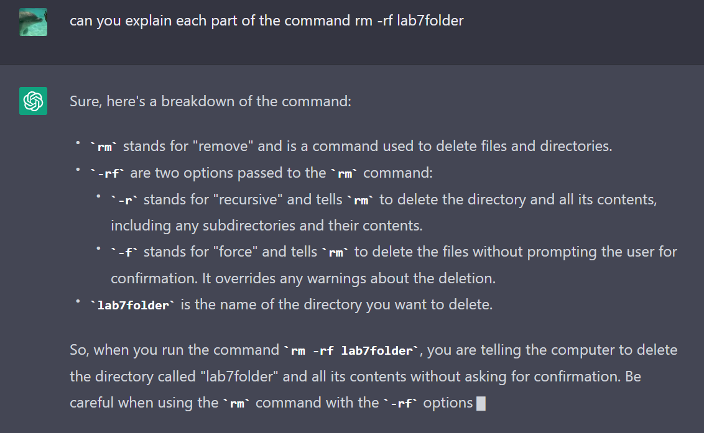
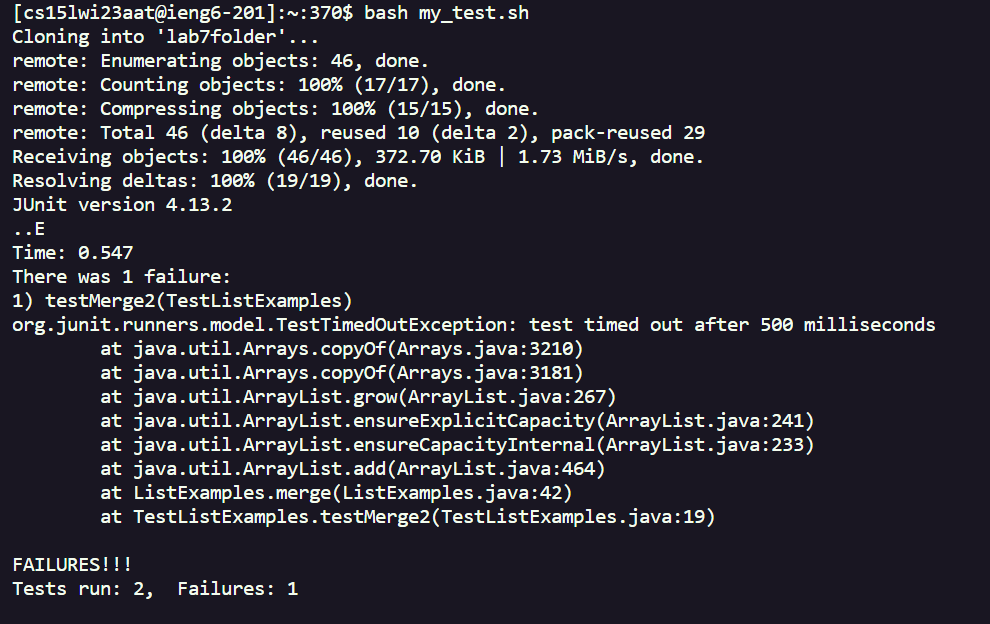
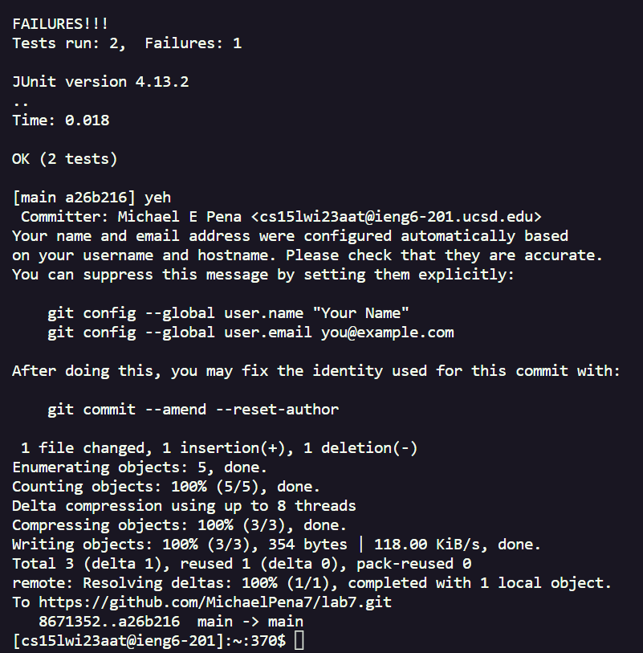

**Lab Report 5**

Here, I will be expanding upon Lab Report 4 and explore how I went about speeding up the process in executing steps four through nine with a bash script that encompasses the general goal 
of steps four through nine.

First, I simply copied all the command lines I used into a bash script. At first, I wanted to create a bash file from my ieng6 account and thoroughly create one through there. However, I soon realized that it would have me have to constantly edit it with "nano". Deeming this as tedious with all the \<Ctrl+O> and \<Ctrl+X> I would have to do, I decided to simply create a bash file called "test.sh" and simulate what I am meant to do before logging into my ieng6 account.

Here is all the commands I inputted into test.sh, which came directly from my Lab Report 4.

You might notice that my "ssh ieng6" login command is missing. This is because after testing it out and inserting the command into the test.sh file, after I inputted my password, it strangely halts the bash file from there, not being able to access the rest of the commands in the file. I decided to ask ChatGPT about this, and it seems as though the change in environment fromy my personal directories to my ieng6 account directories results in this exit

As a result, I decided that I would just have to input the command in manually, so I will still have to type out "ssh <my ieng6 user>" along with the password.

Continuing on, I then had to edit the bash code to work now. Copy and pasting won't work, as you will be met with this error here after your first attempt at editing the file:

This is because something very slightly different that I did compared to my Lab Report 4 was add "lab7folder" at the end of the "git clone" command. This would create a new directory to store the cloned repository, called "lab7folder". However, after the first attempt, the folder would already exist from the previous attempt, meaning it needs to be deleted as files and directories are not allowed to be of the same name. I opted to use "rm" to acheive this, and with the help of ChatGPT, implemented "rm -rf lab7folder"

To break this down, "rm" means to remove a file entirely, "-rf" are two combined options for rm, "r" being to recursively find all directories and files in lab7folder and delete them, while "f" means to remove it forcefuflly, bypassing any warnings and safeguards for deletion, and finally "lab7folder" is the exact directory to be deleted. Here is where I got this information, from ChatGPT of course:

Finally, I now needed to create the bash file in my ieng6 account. To do this, all you need to do is prompt "nano <<name of file>>.sh", and it will open up a new file to be edited. From there, I logged in, typed "nano my_test.sh", did <Ctrl+X>, pasted all the contents onto the newly open file, pressed <enter> to confirm my changes, and exited with <Ctrl+X>. I then ran the file, and it seemed to be successful! All I needed to do was log in normally, typed "bash my_test.sh", edited the file from nano, and was given these successful results, just from a bash script!
  

 
  
