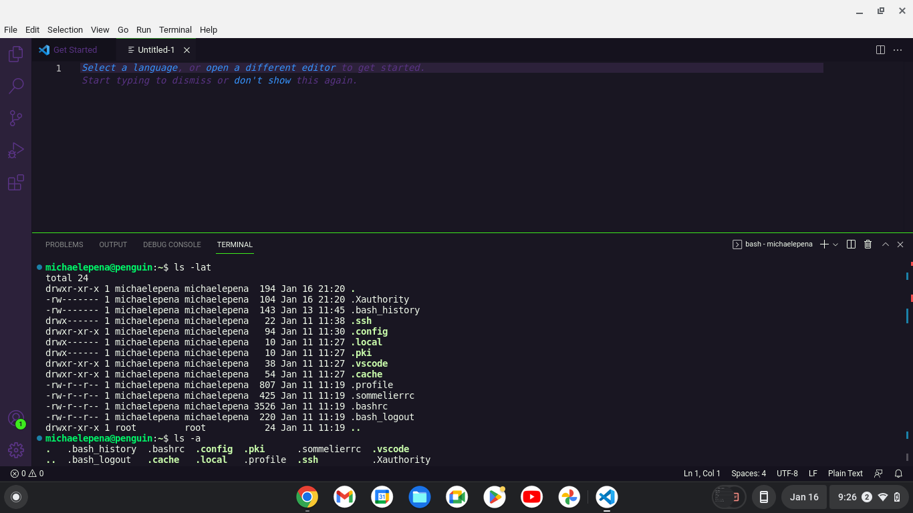
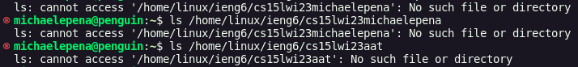

**Lab Report 1**

For this lab report, I will be describing a step by step process in the method I used to download VSCode, using it to remotely connect, then attempting some commands!

For the first part, it was atypical of a standard download. This is because my chromebook runs ChromeOS rather than Windows, making installation of VSCode slightly tricky. Firstly, I had to download Linux on my computer, which essentially would act like a program that VSCode could use to run. To do this, yousimply had to look up "Linux" in your chromebook's settings. Although this is the screen I have since I already downloaded Linux, normally you would have an option to download Linux rather tham the option to remove Linux as shown here in this screenshot.

After waiting a few minutes for Linux to download, I was now ready to download VSCode! I went over to the installation download website through a quick google search of "VSCode Download"

Here, I had to pick the small "arm64" under the .deb in the middle underneath the penguin. This was the version I needed to download in order for VSCode to run on my laptop specifically. Finally, once it finished downloading, I was now ready to begin using VSCode!

To start connecting remotely with the rest of my classmates, I opened a new file and opened up its terminal. It ended up looking something like this

From there, I had to type out "ssh cs15lwi23xx@ieng6.ucsd.edu" into the terminal. However, rather than the "xx", I replaced those with my unique set of characters. I was able to get those through login in in the website here: https://sdacs.ucsd.edu/~icc/index.php. From there, you login with your UCSD account user and your PID. You then had to quickly update a password for this class, as being new to the CSE15L class, we haven't logged in to the class yet. Once you login, however, it will immediately display your unique two characters as I mentioned before. However, since we just updated the password for CSE15L, we have to wait a couple of minutes for the system to process the change, as we do in fact need that specific password to login to our VSCode account. Once the 5-10 minutes are up, you are now set to login!

Once you type in "ssh cs15lwi23xx@ieng6.ucsd.edu" with your special characters replacing "xx", you will be asked for a password. A successful attempt results in these two images above! Unfortunately for me, I actually forgot about the downtime needed for your account to process the password change, resulting in the 47 attempt message shown in the picture. However, this did give me a glimpse of what occurs when you fail a password. The first two failed attempts will repeat the "Password:" line. Next, the next three attempts will warn you that permission has been denied. Once you enter the fifth failed attempt, VSCode will halt the password entering process all together and disconnect you, meaning you have to reenter "ssh cs15lwi23xx@ieng6.ucsd.edu" for another 5 attempts!

Back to VSCode, with connecting remotely with others I was now able to try out some commands!

For the first command, I chose "ls -lat" and typed it into an empty terminal entry. It printed out several entries starting from when I first logged into VSCode. Although I'm not entirely sure if this is accurate, it seems to display the records of when I was active in VSCode

Next, I chose "ls -a". It printed out several terms starting with ".". Honestly, I'm not sure what it meant, but several terms were bolded and stood out which peaks my curiosity. Maybe it means files that are currently active and/or on? Here are the results for both of my commands here:

For the last command I'll be showing my attempt on "ls <directory>", with "<directory>" being replaced with "/home/linux/ieng6/cs15lwi23/cs15lwi23name", where "name" should be replaced with one of your group member's name. I tried my own name, and unfortunately it did not work for me, and did not display anything. I even tried using my special characters to see if that could work, and that also didn't work. Here is my attempt here:
  

  
Ultimately, this was my experience downloading and using VSCode to connect to classmates. Hopes this is helpful, and have a good day!
